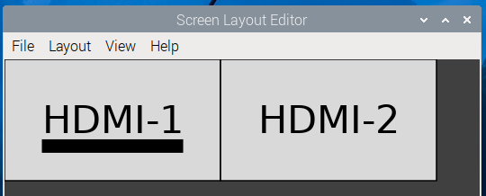

# Introduction


### Basic Configuration of MagicMirror²: 

1. Go to your configuration directory: In Bash/linux, it'll be in `~/MagicMirror/config/`

2. Create and edit a config.js by using your editor of choice. 

3. Minimum configuration requires the following: 

   ``` js
   let config = {
     modules: [
       {
           module: clock,
           position: fullscreen_above,
           config: {
       	}
       },
     ],
   };
   ```

   See [module configuration](/modules/configuration.md) for more information and examples. 

4.  Run your magic mirror. Refer back to [installation](/getting-started/installation.html) if you're not sure how to do so. 

### More useful configuration of your MagicMirror

These directions assume a linux/bash style command line, and previous instructions followed. If not, please insert the path directly from your installation. 

1. Copy `~/MagicMirror/config/config.js.sample` to `~/MagicMirror/config/config.js`. \
   **Note:** If you used a third-party installer script, this step may already have been done for you.

2. Modify your required settings using your preferred editor. `nano` is the easiest. 

3. You can check your configuration running `npm run config:check` in `~/MagicMirror`. 

The following properties can be configured, place them above the modules item:

| **Option**         | **Description**                                              | Default Value                              |
| ------------------ | ------------------------------------------------------------ | ------------------------------------------ |
| `port`             | The port on which the MagicMirror² server will run on. This may need to be changed in specific advanced installations, below. | 8080                                       |
| `address`          | The _interface_ ip address on which to accept connections. The default prevents exposing the built-in webserver to machines on the local network. To expose it to other machines, use: `0.0.0.0`. | `localhost`                                |
| `ipWhitelist`      | The list of IPs from which you are allowed to access the MagicMirror². Add your IP when needed. You can also specify IP ranges with subnet masks (`["127.0.0.1", "127.0.0.1/24"]`) or directly with (`["127.0.0.1", ["192.168.0.1", "192.168.0.100"]]`). Set `[]` to allow all IP addresses. For more information see: [ipWhitelist HowTo](https://forum.magicmirror.builders/topic/1326/ipwhitelist-howto) | `["127.0.0.1", "::ffff:127.0.0.1", "::1"]` |
| `zoom`             | This allows to scale the mirror contents with a given zoom factor. | `1.0`                                      |
| `language`         | The language of the interface. (Note: Not all elements will be localized.) Possible values are `en`, `nl`, `ru`, `fr`, etc. for the full list see: [List of ISO 639-1 codes](https://en.wikipedia.org/wiki/List_of_ISO_639-1_codes) | `en`                                       |
| `timeFormat`       | The form of time notation that will be used. Possible values are `12` or `24`. | 24                                         |
| `units`            | The units that will be used in the default weather modules. Possible values are `metric` or `imperial`. | `metric`                                   |
| `electronOptions`  | An optional array of Electron (browser) options. This allows configuration of e.g. the browser screen size and position (example: `electronOptions: { fullscreen: false, width: 800, height: 600 }`). Kiosk mode can be enabled by setting `kiosk: true`, `autoHideMenuBar: false` and `fullscreen: false`. More options can be found [here](https://github.com/electron/electron/blob/master/docs/api/browser-window.md). This will most likely be used in advanced installations, below. | []                                         |
| `electronSwitches` | An optional array of Electron switches. This allows configuration of electron app itself. <br> This properties will not affect the `serveronly` mode. Usually normal `MM` users don't need this property, but if you are a hard-core hacker, you might need this to handle Electron itself over `MagicMirror` provides. More options can be found [here](https://www.electronjs.org/docs/latest/api/command-line-switches) (Not all available switches are described there.)<br>example:`electronSwitches:["enable-transparent-visuals", "disable-gpu"];` | []                                         |
| `customCss`        | The path of the `custom.css` stylesheet. The default is `css/custom.css`. | `css/custom.css`                           |

After the above options, you will then add modules. See [module configuration](/modules/configuration.md) for more information.


### Advanced configuration and frequently asked how to configure examples: 


#### Bash Environment variables

There are two environment variables that override part or all of config.js. They are: 

| Environment Variable Name | Use                                                          |
| ------------------------- | ------------------------------------------------------------ |
| MM_CONFIG_FILE            | This specifies an alternate configuration file for the system. This is useful when running multiple mirrors on the same device. This does not work with the template option below. NOTE: this file ***MUST*** be located in a directory within the MagicMirror directory. Ideally, place any config file in the config subdirectory. |
| MM_PORT                   | This specifies an alternate TCPIP port, overriding "port" item within the config file. This is useful for testing to see if the product will run using another port. |

##### Examples of use: 

You have created two config files, named config.js and config2.js 

By default, you would use config.js with a bash script (mm.sh): 

```bash
cd ~/MagicMirror
npm start
```

To use the 2nd configuration file, use a bash script like this (mm2.sh):

```bash
cd ~/MagicMirror
export MM_CONFIG_FILE=config/config2.js
npm start
```

To change the port: 

```bash
cd ~/MagicMirror
export MM_PORT=8081 
npm start		
```

You can run `npm run config:check` on your 2nd configuration file by typing the export line in first, example: 

```bash
export MM_CONFIG_FILE=config/config2.js 
npm run config:check
```

```
[26.12.2023 18:13.12.972] [INFO]  Checking file...  /home/<user>/MagicMirror/config/config2.js
[26.12.2023 18:13.13.062] [INFO]  Your configuration file doesn't contain syntax errors :)
```


#### Configuration Template system: 

`config.js.template` can be used instead of `config.js`. This allows you to use variables to replace hardcoded options. When starting MagicMirror² a `config.js` is created from `config.js.template` and the variables are resolved. This is most useful for tech support provided on the [forums](http://forum.magicmirror.builders) and sharing your configuration. Note: You cannot use this with MM_CONFIG_FILE above at this time. 

Variables must be inserted as `${MY_VARIABLE}`, examples:

`config.js.template`:

```javascript
let config = {
	address: "${MY_ADDRESS}",
	port: ${MY_PORT},
	useHttps: ${MY_HTTPS},
};
/*************** DO NOT EDIT THE LINE BELOW ***************/
if (typeof module !== "undefined") {module.exports = config;}
```

would become

`config.js`:

```javascript
let config = {
  address: "localhost",
  port: 8080,
  useHttps: false,
};
/*************** DO NOT EDIT THE LINE BELOW ***************/
if (typeof module !== "undefined") {
  module.exports = config;
}
```

##### Defining variables:

There are 2 ways to define variables, you can mix as needed or desired. If a variable is defined
in both ways the linux environment variable is used.

##### Using a `config.env` file

This file must be in the same folder as the `config.js.template` and contains
the variables, using the example from above:

File content of `config.env`:

```
MY_ADDRESS=localhost
MYPORT=8080
MY_HTTPS=false
```

##### Using linux environment variables

define them before you start MagicMirror², in a bash script, for example: 

```bash
cd ~/MagicMirror
export MY_ADDRESS=localhost
export MYPORT=8080
export MY_HTTPS=false
npm start
```


#### Using `electronOptions`: 

The most common use for `electronOptions` is a dual monitor setup on a Raspberry Pi 4 or greater. To do so, you can launch a second MagicMirror and use `electronOptions` to move it over to the next monitor. For example:

You have two 1920x1080 monitors set up in the Pi as sitting next to each other: 



To move the pi to the second monitor, use this: 

```js
var config = {
	electronOptions: { x: 1920 },
	...
```


#### A Couple of Real World Examples: 

##### Two Screens: 

A user has two monitors running on a Pi4B.  User wants to show cameras on one monitor, and wants to show informational panels on the other. Monitors are set up as above. 

User would have to set up two config files, and two starting scripts to do so. User would use method of choice to launch starting scripts (e.g.: `PM2`). 

Starting Script 1 (mm.sh): 

```bash
cd ~/MagicMirror
npm start
```

Starting Script 2 (mm2.sh): 

```bash
cd ~/MagicMirror
export MM_CONFIG_FILE=config/config2.js
npm start
```

Configuration file 1 (config.js): 

``` js
var config = {
	address: "0.0.0.0", // Can be whatever you set as your original.
	port: 8080, // Must be different than the other configuration file. 
	ipWhitelist: [], // Can be whatever you set as your original.
	language: "en",
	timeFormat: 12,
	units: "imperial",
	//logLevel: ["INFO", "LOG", "WARN", "ERROR", "DEBUG"],
	modules: [
	(insert module configurations here)
	] // end of modules 
}; // end of config variable. 
/*************** DO NOT EDIT BELOW ***************/
if (typeof module !== "undefined") {
	module.exports = config;
}
```

Configuration file 2 (config2.js):

```js
var config = {
	electronOptions: { x: 1920 },
	address: "0.0.0.0", // can be whatever you set as your original. 
	port: 8081, // Must be different than the other configuration file.
	ipWhitelist: [], // Can be whatever you set as your original.
	language: "en",
	timeFormat: 12,
	units: "imperial",
	//logLevel: ["INFO", "LOG", "WARN", "ERROR", "DEBUG"],
	modules: [
	(insert module configurations here)
	] // end of modules 
}; // end of config variable. 
/*************** DO NOT EDIT BELOW ***************/
if (typeof module !== "undefined") {
	module.exports = config;
}
```


##### config.js.template example:

User likes to help German language users in the forums. As such, he wants to be able to paste bits of his config.js into the forums to show as an example, but don't want to share his private data, and has a hard time remembering to remove them from the config.js file. 

```config.js.template```: 

```javascript
let config = {
  address: "0.0.0.0",
  port: 8080,
  ipWhitelist: [],

  language: "de",
  logLevel: ["INFO", "LOG", "WARN", "ERROR"],
  timeFormat: 24,
  units: "metric",

  modules: [
    {
      module: "MMM-RAIN-MAP",
      position: "bottom_left",
      config: {
        animationSpeedMs: 400,
        colorizeTime: false,
        defaultZoomLevel: 8,
        displayTime: true,
        displayClockSymbol: true,
        displayOnlyOnRain: false,
        extraDelayLastFrameMs: 2000,
        markers: [
          { lat: ${LAT}, lng: ${LON}, color: "black" },
        ],
        mapPositions: [
          { lat: ${LAT}, lng: ${LON}, zoom: 9, loops: 1 },
          { lat: ${LAT}, lng: ${LON}, zoom: 8, loops: 1 },
          { lat: ${LAT}, lng: ${LON}, zoom: 7, loops: 1 },
          { lat: ${LAT}, lng: ${LON}, zoom: 6, loops: 1 },
        ],
        mapUrl: "${MAPBOX_URL}",
        mapHeight: "320px",
        mapWidth: "520px",
        updateIntervalInSeconds: 300,
      }
    },
    {
      module: "MMM-Strava",
      header: "Strava",
      position: "bottom_left",
      config: {
        client_id: "16228",
        client_secret: "${STRAVA_API_KEY}",
        activities: ["ride"],
        period: "recent",
        stats: ["count", "distance", "elevation", "achievements"],
        auto_rotate: true,
        updateInterval: 20000,
        reloadInterval: 3600000,
        showPrivateStats: true,
        limitPrivateStats: 1200,
        digits: 0
      }
    },
    {
      module: "MMM-OpenWeatherForecast",
      header: "Wetter",
      position: "top_center",
      config: {
        apikey: "${OPENWEATHER_API_KEY}",
        latitude: "${LAT}",
        longitude: "${LON}",
        showHourlyForecast: false,
        colored: false,
        iconset: "3c",
        label_days: ["So", "Mo", "Di", "Mi", "Do", "Fr", "Sa"],
        concise: false,
        forecastHeaderText: "",
        label_sunriseTimeFormat: "k:mm",
        label_high: "",
        label_low: "",
        displayKmhForWind: true
      }
    },
    {
      module: "calendar",
      header: "Termine",
      position: "top_right",
      config: {
        timeFormat: "absolute",
        showEnd: false,
        dateFormat: "DD.MM.",
        maximumEntries: 10,
        maximumNumberOfDays: 70,
        colored: true,
        calendars: [
          {
            symbol: "subway",
            url: "${CAL_URL1}"
          },
          {
            symbol: "cake-candles",
            url: "${CAL_URL2}"
          },
          {
            symbol: "angle-right",
            color: "#999999",
            url: "${CAL_URL3}"
          }
        ]
      }
    },
  ]
};

/*************** DO NOT EDIT THE LINE BELOW ***************/
if (typeof module !== "undefined") {module.exports = config;}
```

Matching  `config.env` example (fake urls and locations): 

```bash
LAT=0.0
LON=0.0 
MAPBOX_URL="http://example.url/1458562" 
STRAVA_API_KEY="FakeKey1234"
OPENWEATHER_API_KEY="FakeKey4321"
CAL_URL1="https://calendar.google.com/calendar/ical/example@example.example/private-fakeaddress12445812581119058955b/basic.ics"
CAL_URL2="https://calendar.google.com/calendar/ical/example@example.example/private-fakeaddress2445812581119058955b/basic.ics"
CAL_URL3="https://calendar.google.com/calendar/ical/example@example.example/private-fakeaddress32445812581119058955b/basic.ics"
```

For other help with setting up a more complex Mirror, please visit our forums at http://forum.magicmirror.builders 
