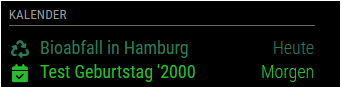
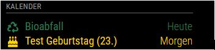

# Calendar

The `calendar` module is one of the default modules of the MagicMirror. This
module displays events from a public .ical calendar. It can combine multiple
calendars.

## Using the module

To use this module, add it to the modules array in the `config/config.js` file:

```js
    {
      module: "calendar",
      position: "top_left", // This can be any of the regions. Best results in left or right regions.
      config: {
        // The config property is optional.
        // If no config is set, an example calendar is shown.
        // See 'Configuration options' for more information.
      },
    },
```

## Configuration options

The following properties can be configured:

| Option                                | Description                                                                                                                                                                                                                                                                                                                                                                                                                                                                                                                                                                                                                                                                                                                                                                                                                                                                                                                                                                                                                                                                                                                                                                                                                                                                                                                                         |
| ------------------------------------- | --------------------------------------------------------------------------------------------------------------------------------------------------------------------------------------------------------------------------------------------------------------------------------------------------------------------------------------------------------------------------------------------------------------------------------------------------------------------------------------------------------------------------------------------------------------------------------------------------------------------------------------------------------------------------------------------------------------------------------------------------------------------------------------------------------------------------------------------------------------------------------------------------------------------------------------------------------------------------------------------------------------------------------------------------------------------------------------------------------------------------------------------------------------------------------------------------------------------------------------------------------------------------------------------------------------------------------------------------- |
| `maximumEntries`                      | The maximum number of events shown. / **Possible values:** `0` - `100` <br> **Default value:** `10`                                                                                                                                                                                                                                                                                                                                                                                                                                                                                                                                                                                                                                                                                                                                                                                                                                                                                                                                                                                                                                                                                                                                                                                                                                                 |
| `maximumNumberOfDays`                 | The maximum number of days in the future. <br><br> **Default value:** `365`                                                                                                                                                                                                                                                                                                                                                                                                                                                                                                                                                                                                                                                                                                                                                                                                                                                                                                                                                                                                                                                                                                                                                                                                                                                                         |
| `pastDaysCount`                       | The number of days of which events in the past should be displayed. <br><br> **Default value:** `0`<br> `NOTE: this value is advisory to any module processing the events broadcast.`<br>`the default calendar module never displays events from the past`                                                                                                                                                                                                                                                                                                                                                                                                                                                                                                                                                                                                                                                                                                                                                                                                                                                                                                                                                                                                                                                                                          |
| `displaySymbol`                       | Display a symbol in front of an entry. <br><br> **Possible values:** `true` or `false` <br> **Default value:** `true`                                                                                                                                                                                                                                                                                                                                                                                                                                                                                                                                                                                                                                                                                                                                                                                                                                                                                                                                                                                                                                                                                                                                                                                                                               |
| `defaultSymbol`                       | The default symbol. <br><br> **Possible values:** See [Font Awesome](https://fontawesome.com/v6/search?o=r&m=free) website. <br> **Default value:** `calendar`                                                                                                                                                                                                                                                                                                                                                                                                                                                                                                                                                                                                                                                                                                                                                                                                                                                                                                                                                                                                                                                                                                                                                                                      |
| `showLocation`                        | Whether to show event locations. <br><br> **Possible values:** `true` or `false` <br> **Default value:** `false`                                                                                                                                                                                                                                                                                                                                                                                                                                                                                                                                                                                                                                                                                                                                                                                                                                                                                                                                                                                                                                                                                                                                                                                                                                    |
| `maxTitleLength`                      | The maximum title length. <br><br> **Possible values:** `10` - `50` <br> **Default value:** `25`                                                                                                                                                                                                                                                                                                                                                                                                                                                                                                                                                                                                                                                                                                                                                                                                                                                                                                                                                                                                                                                                                                                                                                                                                                                    |
| `maxLocationTitleLength`              | The maximum location title length. <br><br> **Possible values:** `10` - `50` <br> **Default value:** `25`                                                                                                                                                                                                                                                                                                                                                                                                                                                                                                                                                                                                                                                                                                                                                                                                                                                                                                                                                                                                                                                                                                                                                                                                                                           |
| `wrapEvents`                          | Wrap event titles to multiple lines. Breaks lines at the length defined by `maxTitleLength`. <br><br> **Possible values:** `true` or `false` <br> **Default value:** `false`                                                                                                                                                                                                                                                                                                                                                                                                                                                                                                                                                                                                                                                                                                                                                                                                                                                                                                                                                                                                                                                                                                                                                                        |
| `wrapLocationEvents`                  | Wrap event location titles to multiple lines. Breaks lines at the length defined by `maxLocationTitleLength`. <br><br> **Possible values:** `true` or `false` <br> **Default value:** `false`                                                                                                                                                                                                                                                                                                                                                                                                                                                                                                                                                                                                                                                                                                                                                                                                                                                                                                                                                                                                                                                                                                                                                       |
| `maxTitleLines`                       | The maximum number of lines a title will wrap vertically before being cut (Only enabled if `wrapEvents` is also enabled). <br><br> **Possible values:** `0` - `10` <br> **Default value:** `3`                                                                                                                                                                                                                                                                                                                                                                                                                                                                                                                                                                                                                                                                                                                                                                                                                                                                                                                                                                                                                                                                                                                                                      |
| `maxEventTitleLines`                  | The maximum number of lines a location title will wrap vertically before being cut (Only enabled if `wrapLocationEvents` is also enabled). <br><br> **Possible values:** `0` - `10` <br> **Default value:** `3`                                                                                                                                                                                                                                                                                                                                                                                                                                                                                                                                                                                                                                                                                                                                                                                                                                                                                                                                                                                                                                                                                                                                     |
| `fetchInterval`                       | How often does the content needs to be fetched? (Milliseconds) <br><br> **Possible values:** `60000` - `86400000` <br> **Default value:** `300000` (5 minutes)                                                                                                                                                                                                                                                                                                                                                                                                                                                                                                                                                                                                                                                                                                                                                                                                                                                                                                                                                                                                                                                                                                                                                                                      |
| `animationSpeed`                      | Speed of the update animation. (Milliseconds) <br><br> **Possible values:** `0` - `5000` <br> **Default value:** `2000` (2 seconds)                                                                                                                                                                                                                                                                                                                                                                                                                                                                                                                                                                                                                                                                                                                                                                                                                                                                                                                                                                                                                                                                                                                                                                                                                 |
| `fade`                                | Fade the future events to black. (Gradient) <br><br> **Possible values:** `true` or `false` <br> **Default value:** `true`                                                                                                                                                                                                                                                                                                                                                                                                                                                                                                                                                                                                                                                                                                                                                                                                                                                                                                                                                                                                                                                                                                                                                                                                                          |
| `fadePoint`                           | Where to start fade? <br><br> **Possible values:** `0` (top of the list) - `1` (bottom of list) <br> **Default value:** `0.25`                                                                                                                                                                                                                                                                                                                                                                                                                                                                                                                                                                                                                                                                                                                                                                                                                                                                                                                                                                                                                                                                                                                                                                                                                      |
| `tableClass`                          | Name of the classes issued from `main.css`. <br><br> **Possible values:** xsmall, small, medium, large, xlarge. <br> **Default value:** _small._                                                                                                                                                                                                                                                                                                                                                                                                                                                                                                                                                                                                                                                                                                                                                                                                                                                                                                                                                                                                                                                                                                                                                                                                    |
| `calendars`                           | The list of calendars. <br><br> **Possible values:** An array, see _calendar configuration_ below. <br> **Default value:** _An example calendar._                                                                                                                                                                                                                                                                                                                                                                                                                                                                                                                                                                                                                                                                                                                                                                                                                                                                                                                                                                                                                                                                                                                                                                                                   |
| `titleReplace`                        | DEPRECATED, please consider switching to `customEvents` <br><br>An object of textual replacements applied to the tile of the event. This allow to remove or replace certain words in the title. <br><br> **Example:** `{'Birthday of ' : '', 'foo':'bar'}` <br> **Default value:** `{ "De verjaardag van ": "", "'s birthday": "" }`                                                                                                                                                                                                                                                                                                                                                                                                                                                                                                                                                                                                                                                                                                                                                                                                                                                                                                                                                                                                                |
| `displayRepeatingCountTitle`          | Show count title for yearly repeating events (e.g. "X. Birthday", "X. Anniversary") <br><br> **Possible values:** `true` or `false` <br> **Default value:** `false`                                                                                                                                                                                                                                                                                                                                                                                                                                                                                                                                                                                                                                                                                                                                                                                                                                                                                                                                                                                                                                                                                                                                                                                 |
| `dateFormat`                          | Format to use for the date of events when using absolute dates. (version <= 2.16.0) From version 2.16.0, this option will be used to format absolute and relative dates. (e.g. DD/MM/YY to change from the default MM/DD/YYYY) <br><br> To show the event time along with the date, use a format like `MMM Do HH:mm`. Depending on configuration, may also require the options `timeFormat:"absolute", urgency:0, getRelative:0,` <br><br> **Possible values:** See [Moment.js formats](https://momentjs.com/docs/#/parsing/string-format/) <br> **Default value:** `MMM Do` (e.g. Jan 18th)                                                                                                                                                                                                                                                                                                                                                                                                                                                                                                                                                                                                                                                                                                                                                        |
| `dateEndFormat`                       | Format to use for the end time of events <br><br> **Possible values:** See [Moment.js formats](https://momentjs.com/docs/#/parsing/string-format/) <br> **Default value:** `HH:mm` (e.g. 16:30)                                                                                                                                                                                                                                                                                                                                                                                                                                                                                                                                                                                                                                                                                                                                                                                                                                                                                                                                                                                                                                                                                                                                                     |
| `showEnd`                             | Whether to show the end time of events <br><br> **Possible values:** `true` or `false` <br> **Default value:** `true`                                                                                                                                                                                                                                                                                                                                                                                                                                                                                                                                                                                                                                                                                                                                                                                                                                                                                                                                                                                                                                                                                                                                                                                                                               |
| `showEndsOnlyWithDuration`            | Whether to **PREVENT** showing the end date of full day events if showEnd is true <br><br> **Possible values:** `true` or `false` <br> **Default value:** `false`                                                                                                                                                                                                                                                                                                                                                                                                                                                                                                                                                                                                                                                                                                                                                                                                                                                                                                                                                                                                                                                                                                                                                                                   |
| `fullDayEventDateFormat`              | Format to use for the date of full day events (when using absolute dates) <br><br> **Possible values:** See [Moment.js formats](https://momentjs.com/docs/#/parsing/string-format/) <br> **Default value:** `MMM Do` (e.g. Jan 18th) <br><br> starting with version 2.30.0 this format will be used for the End date if showEnd is true and the end date is different than the start date.                                                                                                                                                                                                                                                                                                                                                                                                                                                                                                                                                                                                                                                                                                                                                                                                                                                                                                                                                          |
| `timeFormat`                          | Display event times as absolute dates, or relative time, or using absolute date headers with times for each event next to it <br><br> **Possible values:** `absolute` or `relative` or `dateheaders` <br> **Default value:** `relative`                                                                                                                                                                                                                                                                                                                                                                                                                                                                                                                                                                                                                                                                                                                                                                                                                                                                                                                                                                                                                                                                                                             |
| `getRelative`                         | How much time (in hours) should be left until calendar events start getting relative? <br><br> **Possible values:** `0` (events stay absolute) - `48` (48 hours before the event starts) <br> **Default value:** `6`                                                                                                                                                                                                                                                                                                                                                                                                                                                                                                                                                                                                                                                                                                                                                                                                                                                                                                                                                                                                                                                                                                                                |
| `urgency`                             | When using a timeFormat of `absolute`, the `urgency` setting allows you to display events within a specific time frame as `relative`. This allows events within a certain time frame to be displayed as relative (in xx days) while others are displayed as absolute dates <br><br> **Possible values:** a positive integer representing the number of days for which you want a relative date, for example `7` (for 7 days) <br><br> **Default value:** `7`                                                                                                                                                                                                                                                                                                                                                                                                                                                                                                                                                                                                                                                                                                                                                                                                                                                                                        |
| `broadcastEvents`                     | If this property is set to true, the calendar will broadcast all the events to all other modules with the notification message: `CALENDAR_EVENTS`. The event objects are stored in an array and contain the following fields: `title`, `startDate`, `endDate`, `fullDayEvent`, `location` and `geo`. <br><br> **Possible values:** `true`, `false` <br><br> **Default value:** `true`                                                                                                                                                                                                                                                                                                                                                                                                                                                                                                                                                                                                                                                                                                                                                                                                                                                                                                                                                               |
| `hidePrivate`                         | Hides private calendar events. <br><br> **Possible values:** `true` or `false` <br> **Default value:** `false`                                                                                                                                                                                                                                                                                                                                                                                                                                                                                                                                                                                                                                                                                                                                                                                                                                                                                                                                                                                                                                                                                                                                                                                                                                      |
| `hideOngoing`                         | Hides calendar events that have already started. <br><br> **Possible values:** `true` or `false` <br> **Default value:** `false`                                                                                                                                                                                                                                                                                                                                                                                                                                                                                                                                                                                                                                                                                                                                                                                                                                                                                                                                                                                                                                                                                                                                                                                                                    |
| `excludedEvents`                      | An array of words / phrases from event titles that will be excluded from being shown. <br><br>Additionally advanced filter objects can be passed in. Below is the configuration for the advance filtering object.<br>**Required**<br>`filterBy` - string used to determine if filter is applied.<br>**Optional**<br>`until` - Time before an event to display it Ex: [`'3 days'`, `'2 months'`, `'1 week'`]<br>`caseSensitive` - By default, excludedEvents are case insensitive, set this to true to enforce case sensitivity<br>`regex` - set to `true` if filterBy is a regex. For those not familiar with regex it is used for pattern matching, please see [here](https://regexr.com/) for more info.<br><br> **Example:** `['Birthday', 'Hide This Event', {filterBy: 'Payment', until: '6 days', caseSensitive: true}, {filterBy: '^[0-9]{1,}.*', regex: true}]` <br> **Default value:** `[]`                                                                                                                                                                                                                                                                                                                                                                                                                                                |
| `broadcastPastEvents`                 | If this is set to true, events from the past `maximumNumberOfDays` will be included in event broadcasts <br> **Default value:** `false`                                                                                                                                                                                                                                                                                                                                                                                                                                                                                                                                                                                                                                                                                                                                                                                                                                                                                                                                                                                                                                                                                                                                                                                                             |
| `sliceMultiDayEvents`                 | If this is set to true, events exceeding at least one midnight will be sliced into separate events including a counter like (1/2). This is especially helpful in "dateheaders" mode. Events will be sliced at midnight, end time for all events but the last will be 23:59 <br> **Default value:** `false`                                                                                                                                                                                                                                                                                                                                                                                                                                                                                                                                                                                                                                                                                                                                                                                                                                                                                                                                                                                                                                          |
| `nextDaysRelative`                    | If this is set to true, the **FULL DAY** appointments of today and tomorrow are displayed relatively, even if the timeformat is set to absolute. <br> **Default value:** `false`                                                                                                                                                                                                                                                                                                                                                                                                                                                                                                                                                                                                                                                                                                                                                                                                                                                                                                                                                                                                                                                                                                                                                                    |
| `customEvents`                        | An array of `keyword`/`symbol`/`color`/`transform` that will customize events based on keyword in title. <br> <br> `keyword` is a case-insensitive string that if present in event title will trigger the use of custom symbol and/or color for that event,<br>`symbol` is the Font Awesome icon to use as symbol and<br> `color` is the CSS color to use for the event.<br>`transform` is an object for regular expression text replacement of the calendar title consisting of the following elements:<br>- `search` regular expression to search for<br>- `replace` replace string, may contain group match references<br>- `yearmatchgroup` (optional) the regex match group of a year that you want to replace to the current age<br><br>`keyword` and at least one of `symbol`, `color`, `transform` is required. <br> <br> **Examples:** <br>`customEvents: [{keyword: 'Birthday', symbol: 'birthday-cake', color: 'Gold'}]`<br><br>`customEvents: [{keyword: 'Geburtstag', symbol: 'birthday-cake', color: 'Gold', transform: { search: '^([^\']*) \'(\\d{4})$' , replace: '$1 ($2.)', yearmatchgroup: 2}},{keyword: 'in Hamburg', transform: { search: ' in Hamburg$' , replace: ''}} ]`<br>Will transform<br><br>to<br> |
| `limitDays`                           | If this property is set to a value greater than zero, the number of unique days displayed will be limited to `limitDays` days. <br><br> **Default value:** `0` (no limit)                                                                                                                                                                                                                                                                                                                                                                                                                                                                                                                                                                                                                                                                                                                                                                                                                                                                                                                                                                                                                                                                                                                                                                           |
| `limitDaysNeverSkip`                  | If this property is set to true, every event for every day will be shown regardless of if the day on has a single full day event or not.<br><br> **Default value:** `false`                                                                                                                                                                                                                                                                                                                                                                                                                                                                                                                                                                                                                                                                                                                                                                                                                                                                                                                                                                                                                                                                                                                                                                         |
| `flipDateHeaderTitle`                 | This property determines if the title for the date header in the `dateheaders` time format will align to the left or right. <br><br> **Possible values:** `true` (right) or `false` (left) <br> **Default value:** `false` (left)                                                                                                                                                                                                                                                                                                                                                                                                                                                                                                                                                                                                                                                                                                                                                                                                                                                                                                                                                                                                                                                                                                                   |
| `hideTime`                            | If this property is set to true the time portion on relative times will be hidden.<br><br> **Default value:** `false`                                                                                                                                                                                                                                                                                                                                                                                                                                                                                                                                                                                                                                                                                                                                                                                                                                                                                                                                                                                                                                                                                                                                                                                                                               |
| `hideDuplicates`                      | If this property is set to true, entries with the same title, starting and ending time will be hidden.<br><br> **Default value:** `true`                                                                                                                                                                                                                                                                                                                                                                                                                                                                                                                                                                                                                                                                                                                                                                                                                                                                                                                                                                                                                                                                                                                                                                                                            |
| `showTimeToday`                       | If this property is set to true, the event time will be displayed for same-day events even when relative display is being used.<br><br> **Default value:** `false`                                                                                                                                                                                                                                                                                                                                                                                                                                                                                                                                                                                                                                                                                                                                                                                                                                                                                                                                                                                                                                                                                                                                                                                  |
| `colored`<br>_(deprecated)_           | If this property is set to true, an individual color can be set for each calendar. <br><br> **Default value:** `false`                                                                                                                                                                                                                                                                                                                                                                                                                                                                                                                                                                                                                                                                                                                                                                                                                                                                                                                                                                                                                                                                                                                                                                                                                              |
| `coloredSymbolOnly`<br>_(deprecated)_ | If this property is set to true, an individual symbol color can be set for each calendar, not the whole line. This is only applicable when `colored` is also enabled.<br><br> **Default value:** `false`                                                                                                                                                                                                                                                                                                                                                                                                                                                                                                                                                                                                                                                                                                                                                                                                                                                                                                                                                                                                                                                                                                                                            |
| `coloredText`                         | If this property is set to true, an individual text color can be set for each calendar. <br><br> **Default value:** `false`                                                                                                                                                                                                                                                                                                                                                                                                                                                                                                                                                                                                                                                                                                                                                                                                                                                                                                                                                                                                                                                                                                                                                                                                                         |
| `coloredBorder`                       | If this property is set to true, an individual border color can be set for each calendar.<br><br> **Default value:** `false`                                                                                                                                                                                                                                                                                                                                                                                                                                                                                                                                                                                                                                                                                                                                                                                                                                                                                                                                                                                                                                                                                                                                                                                                                        |
| `coloredSymbol`                       | If this property is set to true, an individual symbol color can be set for each calendar. <br><br> **Default value:** `false`                                                                                                                                                                                                                                                                                                                                                                                                                                                                                                                                                                                                                                                                                                                                                                                                                                                                                                                                                                                                                                                                                                                                                                                                                       |
| `coloredBackground`                   | If this property is set to true, an individual background color can be set for each calendar. <br><br> **Default value:** `false`                                                                                                                                                                                                                                                                                                                                                                                                                                                                                                                                                                                                                                                                                                                                                                                                                                                                                                                                                                                                                                                                                                                                                                                                                   |
| `updateOnFetch`                       | `true`: Updates the module display upon receipt of new data.<br>`false`: Display new data at once every minute (prevent module flashing when using multiple calendars) <br><br> **Default value:** `true`                                                                                                                                                                                                                                                                                                                                                                                                                                                                                                                                                                                                                                                                                                                                                                                                                                                                                                                                                                                                                                                                                                                                           |

#### Default value:

```js
    config: {
      coloredText: false,
      coloredBorder: false,
      coloredSymbol: false,
      coloredBackground: false,
      calendars: [
        {
          url: 'https://www.calendarlabs.com/templates/ical/US-Holidays.ics',
          symbol: 'calendar',
          auth: {
              user: 'username',
              pass: 'SuperStrongPassword',
              method: 'basic'
          }
        },
      ],
    }
```

#### Calendar configuration options:

| Option                | Description                                                                                                                                                                                                                                                                                                                                                                                                                                                                                                                                                                                                                        |
| --------------------- | ---------------------------------------------------------------------------------------------------------------------------------------------------------------------------------------------------------------------------------------------------------------------------------------------------------------------------------------------------------------------------------------------------------------------------------------------------------------------------------------------------------------------------------------------------------------------------------------------------------------------------------- |
| `url`                 | The url of the calendar .ical. This property is required.<br><br> **Possible values:** Any public accessible .ical calendar.                                                                                                                                                                                                                                                                                                                                                                                                                                                                                                       |
| `symbol`              | The symbol to show in front of an event. This property is optional.<br><br> **Possible values:** See [Font Awesome](https://fontawesome.com/v6/search?o=r&m=free) website. To have multiple symbols you can define them in an array e.g. `["calendar", "plane"]`                                                                                                                                                                                                                                                                                                                                                                   |
| `symbolClassName`     | The Font Awesome style prefix + family prefix. This property is optional.<br><br>The default value is `fas fa-fw fa-`, giving a solid symbol from the `fa`-family with a fixed width. The different options can be seen for each icon on the [Font Awesome](https://fontawesome.com/v6/search?o=r&m=free) website. Some symbols are not defined in `fas fa-` and will not display properly if this property isn't set.<br><br>An example is the Facebook-logo (`fab fa-facebook-f`), defined with the style prefix `fab` (Font Awesome Brands). In that case, set `symbolClassName` to `fab fa-` and the `symbol` to `facebook-f`. |
| `color`               | The font, symbol, and border color of an event from this calendar. This property should be set if the config is set to `coloredBorder: true`, `coloredText: true` or `coloredSymbol: true`.<br><br> **Possible values:** HEX, RGB or RGBA values (#efefef, rgb(242,242,242), rgba(242,242,242,0.5)).                                                                                                                                                                                                                                                                                                                               |
| `bgColor`             | The background color of an event from this calendar. This property should be set if the config is set to `coloredBackground: true`.<br><br> **Possible values:** HEX, RGB or RGBA values (#efefef, rgb(242,242,242), rgba(242,242,242,0.5)).                                                                                                                                                                                                                                                                                                                                                                                       |
| `repeatingCountTitle` | The count title for yearly repeating events in this calendar.<br><br> **Example:** `'Birthday'`                                                                                                                                                                                                                                                                                                                                                                                                                                                                                                                                    |
| `maximumEntries`      | The maximum number of events shown. Overrides global setting.<br><br>**Possible values:** `0` - `100`                                                                                                                                                                                                                                                                                                                                                                                                                                                                                                                              |
| `maximumNumberOfDays` | The maximum number of days in the future. Overrides global setting                                                                                                                                                                                                                                                                                                                                                                                                                                                                                                                                                                 |
| `pastDaysCount`       | The number of days of which events in the past should be displayed. Overrides global setting                                                                                                                                                                                                                                                                                                                                                                                                                                                                                                                                       |
| `name`                | The name of the calendar. Included in event broadcasts as `calendarName`.                                                                                                                                                                                                                                                                                                                                                                                                                                                                                                                                                          |
| `auth`                | The object containing options for authentication against the calendar.                                                                                                                                                                                                                                                                                                                                                                                                                                                                                                                                                             |
| `symbolClass`         | Add a class to the cell of symbol.                                                                                                                                                                                                                                                                                                                                                                                                                                                                                                                                                                                                 |
| `titleClass`          | Add a class to the title's cell.                                                                                                                                                                                                                                                                                                                                                                                                                                                                                                                                                                                                   |
| `timeClass`           | Add a class to the time's cell.                                                                                                                                                                                                                                                                                                                                                                                                                                                                                                                                                                                                    |
| `broadcastPastEvents` | Whether to include past events from this calendar. Overrides global setting                                                                                                                                                                                                                                                                                                                                                                                                                                                                                                                                                        |

#### Calendar authentication options:

| Option   | Description                                                                                                                                                                                                                                      |
| -------- | ------------------------------------------------------------------------------------------------------------------------------------------------------------------------------------------------------------------------------------------------ |
| `user`   | The username for HTTP authentication.                                                                                                                                                                                                            |
| `pass`   | The password for HTTP authentication. (If you use Bearer authentication, this should be your BearerToken.)                                                                                                                                       |
| `method` | Which authentication method should be used. HTTP Basic and Bearer authentication methods are supported. Basic authentication is used by default if this option is omitted.<br/>**Possible values:** `basic`, `bearer` **Default value:** `basic` |

## Syncing your Microsoft, Google and Apple calendars

To be able to use your calendar with Microsoft Outlook, Google Calendar and
Apple iCal calendars, you need to either add each, individually or find a way to
sync them into one. There are several free and non-free software that can help
you do this.

For example, in
[this forum thread](https://forum.magicmirror.builders/topic/5327/sync-private-icloud-calendar-with-magicmirror/50?page=1)
are instructions how to sync with `iCal`.

### Two-way Syncing

Here are some various projects that can be used to sync your calendars into one.

- https://github.com/phw198/OutlookGoogleCalendarSync
- https://github.com/Dashbrd/CalendarSyncplus
- https://www.sync2.com/Download.aspx
- https://www.pppindia.com/calendar-sync/index.html
- https://www.fieldstonsoftware.com/software/gsyncit5/Download.aspx
- https://tools.google.com/dlpage/gappssync
- https://www.lifewire.com/how-to-sync-google-calendar-outlook-and-iphone-calendar-1172188
- https://www.makeuseof.com/tag/how-to-sync-microsoft-outlook-with-google-calendar/

### Office 365 Calendar Support

Office 365 calendars create date formats that are incompatible with MM2. Here
are the instructions to fix it:

1. Import your Office 365 calendar into a Google Calendar. This will take care
   of all the previous events of your calendar.
2. Go to [Microsoft Flow](https://flow.microsoft.com) and setup a Flow trigger
   that will create a new event in your Google Calendar whenever an event in
   Office 365 is created.
   [Here is a guide to help with this task.](https://shift.newco.co/sync-your-calendars-using-microsoft-flow-and-yes-google-calendar-works-too-a28be5a604dd)
3. Go to Google Calendar and create a private address to use in the calendar
   module for your MagicMirror.

This trigger will run every 5 minutes. Make sure to give it time after you
create a new event in Office 365 to appear in Google Calendar. Past events will
NOT be created using Flow; to do this, follow step 1 to import your calendar
into Google Calendar.

## Manually fetching calendar

The calendar automatically updates every so or so interval (specified in the
config). It is possible to manually fetch updates from the calendar through
socket notifications.

The calendar subscribes to socket notification `FETCH_CALENDAR` and expects a
payload containing the _url_ to the calendar in which to update.

Socket notifications can be accessed through `this.io` from any MagicMirror
`node_helper`. _(See example)_

```js
this.io.of("calendar").emit("FETCH_CALENDAR", { url: "http://url.to.cal" });
```

It is even possible to access the socket notifications from outside of
MagicMirror. An example can be seen and implemented in @oenstrom s
[MMM-mycroft-bridge](https://github.com/oenstrom/MMM-mycroft-bridge).
