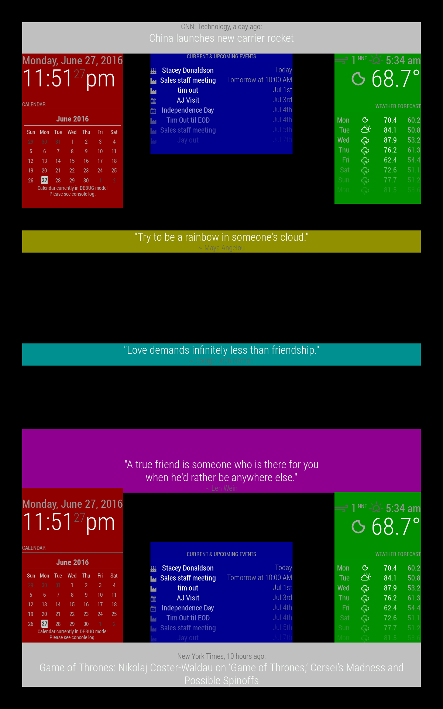

# Module Configuration

The module configuration is used as part of the main configuration file. Please
see [configuration](/configuration/introduction.md) for more information.

| **Option**        | **Description**                                                                                                                                                                                                                                                                                                                                                                                                                                                                                                                                                                                                                                                                                                                                                                                           |
| ----------------- | --------------------------------------------------------------------------------------------------------------------------------------------------------------------------------------------------------------------------------------------------------------------------------------------------------------------------------------------------------------------------------------------------------------------------------------------------------------------------------------------------------------------------------------------------------------------------------------------------------------------------------------------------------------------------------------------------------------------------------------------------------------------------------------------------------- |
| `module`          | The name of the module. This can also contain the subfolder. Valid examples include `clock`, `default/calendar` and `custommodules/mymodule`.                                                                                                                                                                                                                                                                                                                                                                                                                                                                                                                                                                                                                                                             |
| `position`        | The location of the module in which the module will be loaded. The built in values are `top_bar`, `top_left`, `top_center`, `top_right`, `upper_third`, `middle_center`, `lower_third`, `bottom_left`, `bottom_center`, `bottom_right`, `bottom_bar`, `fullscreen_above`, and `fullscreen_below`. This field is optional but most modules require this field to set. (if not set, the module will not be shown, but will run the same) Check the documentation of the module for more information. Multiple modules with the same position will be ordered based on the order in the configuration file, top down.                                                                                                                                                                                        |
|                   | Note: <br><br>if your implementation of MagicMirror wishes to use custom position values, they need to be used in **index.html** , and in the format <br><br>class="region newpos-a newpos-b"<br> <br>MagicMirror will join the last two terms with an underscore to make a position value like <br><br>newpos-a_newpos-b<br><br>example: class="region top3 left" <br>the position will be "top3_left"<br><br>newpos_b is optional<br>class="region top3" would be valid and produce a position of "top3"<br><br>the new position values will be checked during MagicMirror startup and also in the configuration checker <br> node --run config:check <br><br> AND you have to have the appropriate css settings in custom.css for these new region values (top3 and left as used in the example above) |
| `classes`         | One or more additional CSS classes which will be set on the module, as a string of space-separated values. This field is optional.                                                                                                                                                                                                                                                                                                                                                                                                                                                                                                                                                                                                                                                                        |
| `header`          | To display a header text above the module, add the header property. This field is optional.                                                                                                                                                                                                                                                                                                                                                                                                                                                                                                                                                                                                                                                                                                               |
| `hiddenOnStartup` | Set module as being hidden on startup. This field is optional.                                                                                                                                                                                                                                                                                                                                                                                                                                                                                                                                                                                                                                                                                                                                            |
| `disabled`        | Set disabled to `true` to skip creating the module. This field is optional.                                                                                                                                                                                                                                                                                                                                                                                                                                                                                                                                                                                                                                                                                                                               |
| `configDeepMerge` | Allow to merge with internal configuration in deep (Array and/with object). This field is optional (on developer choice generally).                                                                                                                                                                                                                                                                                                                                                                                                                                                                                                                                                                                                                                                                       |
| `animateIn`       | Special animate name when a module appears (see below) This field is optional.                                                                                                                                                                                                                                                                                                                                                                                                                                                                                                                                                                                                                                                                                                                            |
| `animateOut`      | Special animates name when a module should hide (see below) This field is optional.                                                                                                                                                                                                                                                                                                                                                                                                                                                                                                                                                                                                                                                                                                                       |
| `config`          | An object with the module configuration properties. Check the documentation of the module for more information. This field is optional, unless the module requires extra configuration.                                                                                                                                                                                                                                                                                                                                                                                                                                                                                                                                                                                                                   |

## Example

```js
let config = {
  modules: [
    {
      module: "clock",
      position: "top_left",
    },
    {
      module: "compliments",
      position: "lower_third",
    },
    {
      module: "weather",
      position: "top_right",
      classes: "myclass1 myclass2",
      config: {
        weatherProvider: "openweathermap",
        type: "current",
        location: "New York",
        locationID: "5128581", //ID from http://bulk.openweathermap.org/sample/city.list.json.gz; unzip the gz file and find your city
        apiKey: "YOUR_OPENWEATHER_API_KEY",
      },
    },
  ],
};
```

## Position

The locations can be found in the following screenshot by their color:

- `top_bar` and `bottom_bar` are light gray
- `top_left` and `bottom_left` are red
- `top_center` and `bottom_center` are blue
- `top_right` and `bottom_right` are green
- `upper_third` is yellow
- `middle_center` is cyan
- `lower_third` is magenta



Missing are the fullscreen_below and fullscreen_above as those cover the whole
screen, one under everything else and the other above.

All these regions will resize as needed.

## Animated

(_Introduced in version: 2.25.0_)

Animated feature allows to define an animation to a module

- `animateIn`: When module appears
- `animateOut`: When module should hide

The whole of animation names are available [there](animate.md).

::: tip Preview of animations

Check the [animate.css](https://animate.style/) library to see a preview of the
animation name result

:::

### Example with `newsfeed` module

For this example, news will come from the left (`slideInLeft` animation), wait
in the middle, and exit from the right (`slideOutRight` animation)


```js
{
  module: "newsfeed",
  position: "bottom_bar",
  animateIn: "slideInLeft",
  animateOut: "slideOutRight",
  config: {
    feeds: [
      {
        title: "New York Times",
        url: "https://rss.nytimes.com/services/xml/rss/nyt/HomePage.xml"
      }
    ],
    showSourceTitle: true,
    showPublishDate: true,
    broadcastNewsFeeds: true,
    broadcastNewsUpdates: true
  }
},
```
