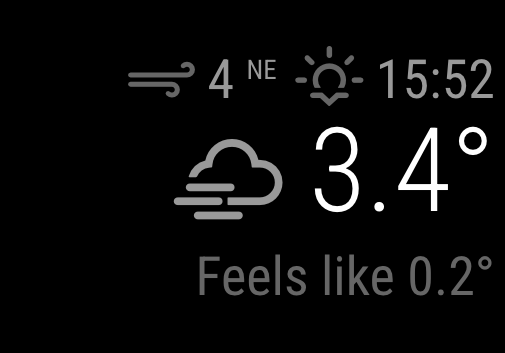
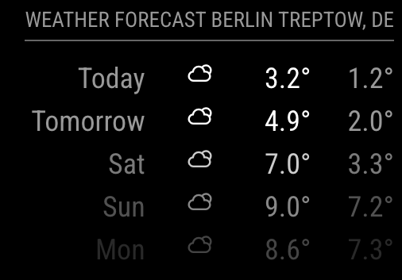

# Weather Module

This module will be configurable to be used as a current weather view, or to
show the forecast. This way the module can be used twice to fulfill both
purposes.

The biggest change is the use of weather providers. This way we are not bound to
one API source. And users can choose which API they want to use as their source.

The module is in a very early stage, and needs a lot of work. It's API isn't set
in stone, so keep that in mind when you want to contribute.

## Screenshot

### Current weather:



### Forecast:



## Usage

To use this module, add it to the modules array in the `config/config.js` file:

```js
    {
      module: "weather",
      position: "top_right",
      config: {
        // See 'Configuration options' for more information.
        type: "current",
      },
    },
```

## Configuration options

The following properties can be configured:

### General options

| Option                         | Description                                                                                                                                                                                                                                                                                                                                                                                                                                                                                                                                                                                                                                                                                                                                                                                                                                        |
| ------------------------------ | -------------------------------------------------------------------------------------------------------------------------------------------------------------------------------------------------------------------------------------------------------------------------------------------------------------------------------------------------------------------------------------------------------------------------------------------------------------------------------------------------------------------------------------------------------------------------------------------------------------------------------------------------------------------------------------------------------------------------------------------------------------------------------------------------------------------------------------------------- |
| `weatherProvider`              | Which weather provider should be used. <br><br> **Possible values:** `openweathermap` , `pirateweather` , `weathergov`, `ukmetofficedatahub`, `ukmetoffice`, `weatherbit`, `envcanada`, `openmeteo`, `weatherflow`, `SMHI` or `yr`<br> **Default value:** `openweathermap`                                                                                                                                                                                                                                                                                                                                                                                                                                                                                                                                                                         |
| `type`                         | Which type of weather data should be displayed. <br><br> **Possible values:** `current` , `hourly` , `daily` , or `forecast` <br> **Default value:** `current` <br><br> **Note:** The `daily` type is another name for the `forecast` type, and the two are interchangeable. <br><br> The `hourly` type is currently only implemented for these provider: <br>- **Environment Canada** (`envcanada`) <br>- **Openmeteo** <br>- **OpenWeatherMap** (`openweathermap`), and only when `/onecall` is used as the specified endpoint. Latitude and longitude [(see below)](/modules/weather.md#openweathermap-options) are **required** for `hourly`. The locationID and location options are ignored when the OpenWeatherMap One Call API is used and you will get wrong weather information.<br>- **Weather.gov** (`weathergov`)<br/>- **Yr** (`yr`) |
| `units`                        | What units to use. Specified by config.js <br><br> **Possible values:** `config.units` = Specified by config.js, `metric` = Celsius, `imperial` = Fahrenheit <br> **Default value:** `config.units`                                                                                                                                                                                                                                                                                                                                                                                                                                                                                                                                                                                                                                                |
| `tempUnits`                    | What units to use for temperature. If not specified, the module uses the `units` value from `config.js`. <br><br> **Possible values:** `config.units` = Specified by config.js, `metric` = Celsius, `imperial` = Fahrenheit <br> **Default value:** `config.units`                                                                                                                                                                                                                                                                                                                                                                                                                                                                                                                                                                                 |
| `windUnits`                    | What units to use for wind speed. If not specified, the module uses the `units` value from `config.js`. <br><br> **Possible values:** `config.units` = Specified by config.js, `mps` or `metric` = metres per second, `kmh` = kilometers per hour, `mph` or `imperial` = miles per hour, `beaufort` = use beaufort scale, `knots` = show wind in knots <br> **Default value:** `units`                                                                                                                                                                                                                                                                                                                                                                                                                                                             |
| `roundTemp`                    | Round temperature value to nearest integer. <br><br> **Possible values:** `true` (round to integer) or `false` (display exact value with decimal point) <br> **Default value:** `false`                                                                                                                                                                                                                                                                                                                                                                                                                                                                                                                                                                                                                                                            |
| `degreeLabel`                  | Show the degree label for your chosen units (Metric = C, Imperial = F). <br><br> **Possible values:** `true` or `false` <br> **Default value:** `false`                                                                                                                                                                                                                                                                                                                                                                                                                                                                                                                                                                                                                                                                                            |
| `updateInterval`               | How often does the content needs to be fetched? (Milliseconds) <br><br> **Possible values:** `1000` - `86400000` <br> **Default value:** `600000` (10 minutes)                                                                                                                                                                                                                                                                                                                                                                                                                                                                                                                                                                                                                                                                                     |
| `animationSpeed`               | Speed of the update animation. (Milliseconds) <br><br> **Possible values:** `0` - `5000` <br> **Default value:** `1000` (1 second)                                                                                                                                                                                                                                                                                                                                                                                                                                                                                                                                                                                                                                                                                                                 |
| `timeFormat`                   | Use 12 or 24 hour format. <br><br> **Possible values:** `12` or `24` <br> **Default value:** uses value of _config.timeFormat_                                                                                                                                                                                                                                                                                                                                                                                                                                                                                                                                                                                                                                                                                                                     |
| `showPeriod`                   | Show the period (am/pm) with 12 hour format <br><br> **Possible values:** `true` or `false` <br> **Default value:** `true`                                                                                                                                                                                                                                                                                                                                                                                                                                                                                                                                                                                                                                                                                                                         |
| `showPeriodUpper`              | Show the period (AM/PM) with 12 hour format as uppercase <br><br> **Possible values:** `true` or `false` <br> **Default value:** `false`                                                                                                                                                                                                                                                                                                                                                                                                                                                                                                                                                                                                                                                                                                           |
| `showPrecipitationAmount`      | Show the amount of rain/snow.<br><br>Not supported by all providers, and some providers do not support all `type`s. Supported providers are `envcanada`, `openmeteo`, `openweathermap`, `smhi`, `weatherbit` and `yr`.<br><br> **Possible values:** `true` or `false` <br> **Default value:** `false`                                                                                                                                                                                                                                                                                                                                                                                                                                                                                                                                              |
| `showPrecipitationProbability` | Show the probability of rain/snow.<br><br>Not supported by all providers, and some providers do not support all `type`s. Supported providers are `envcanada`, `openmeteo`, `openweathermap`, `ukmetoffice`, `ukmetofficedatahub`, `weatherbit`, `weatherflow`, `weathergov` and `yr`.<br><br> **Possible values:** `true` or `false` <br> **Default value:** `false`                                                                                                                                                                                                                                                                                                                                                                                                                                                                               |
| `showUVIndex`                  | Show the UV Index.<br><br>Not supported by all providers. Implemented provider is `openmeteo` but others could have support.<br><br> **Possible values:** `true` or `false` <br> **Default value:** `false`                                                                                                                                                                                                                                                                                                                                                                                                                                                                                                                                                                                                                                        |
| `lang`                         | The language of the days. <br><br> **Possible values:** `en`, `nl`, `ru`, etc ... <br> **Default value:** uses value of _config.language_                                                                                                                                                                                                                                                                                                                                                                                                                                                                                                                                                                                                                                                                                                          |
| `decimalSymbol`                | The decimal symbol to use.<br><br> **Possible values:** `.`, `,` or any other symbol.<br> **Default value:** `.`                                                                                                                                                                                                                                                                                                                                                                                                                                                                                                                                                                                                                                                                                                                                   |
| `initialLoadDelay`             | The initial delay before loading. If you have multiple modules that use the same API key, you might want to delay one of the requests. (Milliseconds) <br><br> **Possible values:** `1000` - `5000` <br> **Default value:** `0`                                                                                                                                                                                                                                                                                                                                                                                                                                                                                                                                                                                                                    |
| `appendLocationNameToHeader`   | If set to `true`, the returned location name will be appended to the header of the module, if the header is enabled. This is mainly interesting when using calender based weather. <br><br> **Default value:** `true`                                                                                                                                                                                                                                                                                                                                                                                                                                                                                                                                                                                                                              |
| `calendarClass`                | The class for the calender module to base the event based weather information on. <br><br> **Default value:** `'calendar'`                                                                                                                                                                                                                                                                                                                                                                                                                                                                                                                                                                                                                                                                                                                         |
| `useCorsProxy`                 | Some weather modules need a cors proxy to get their api running. <br><br> **Possible values:** true or false <br> **Default value:** `false` (except providers `pirateweather` and `envcanada`)                                                                                                                                                                                                                                                                                                                                                                                                                                                                                                                                                                                                                                                    |

#### Current weather options

| Option                      | Description                                                                                                                                                                                          |
| --------------------------- | ---------------------------------------------------------------------------------------------------------------------------------------------------------------------------------------------------- |
| `onlyTemp`                  | Show only current Temperature and weather icon without windspeed, sunset, sunrise time and feels like. <br><br> **Possible values:** `true` or `false` <br> **Default value:** `false`               |
| `showWindDirection`         | Show the wind direction next to the wind speed. <br><br> **Possible values:** `true` or `false` <br> **Default value:** `true`                                                                       |
| `showWindDirectionAsArrow`  | Show the wind direction as an arrow instead of abbreviation <br><br> **Possible values:** `true` or `false` <br> **Default value:** `false`                                                          |
| `showHumidity`              | Whether and where to show the current humidity <br><br> **Possible values:** `wind`, `temp`, `feelslike`, `below` or `none` <br> **Default value:** `none`                                           |
| `showIndoorTemperature`     | If you have another module that emits the `INDOOR_TEMPERATURE` notification, the indoor temperature will be displayed <br> **Default value:** `false`                                                |
| `showIndoorHumidity`        | If you have another module that emits the `INDOOR_HUMIDITY` notification, the indoor humidity will be displayed <br> **Default value:** `false`                                                      |
| `showFeelsLike`             | Shows the Feels like temperature weather. <br><br> **Possible values:** `true` or `false`<br>**Default value:** `true`                                                                               |
| `showSun`                   | Shows Sunrise and Sunset time. <br><br> **Possible values:** `true` or `false`<br>**Default value:** `true`                                                                                          |
| `allowOverrideNotification` | Enables the ability to provide a `CURRENT_WEATHER_OVERRIDE` notification containing a `WeatherObject` payload that will be combined with the existing current weather <br>**Default value:** `false` |

#### Weather forecast options

| Option            | Description                                                                                                                                                                                                                                                                                                                                                                                                                                                                                        |
| ----------------- | -------------------------------------------------------------------------------------------------------------------------------------------------------------------------------------------------------------------------------------------------------------------------------------------------------------------------------------------------------------------------------------------------------------------------------------------------------------------------------------------------- |
| `tableClass`      | The class for the forecast table. <br><br>**Possible values:** `'xsmall'`, `'small'`, `'medium'`, `'large'`, `'xlarge'` <br> **Default value:** `'small'`                                                                                                                                                                                                                                                                                                                                          |
| `colored`         | If set to `true`, the min and max temperature are color coded. <br><br> **Default value:** `false`                                                                                                                                                                                                                                                                                                                                                                                                 |
| `fade`            | Fade the future events to black. (Gradient) <br><br> **Possible values:** `true` or `false` <br> **Default value:** `true`                                                                                                                                                                                                                                                                                                                                                                         |
| `fadePoint`       | Where to start fade? <br><br> **Possible values:** `0` (top of the list) - `1` (bottom of list) <br> **Default value:** `0.25`                                                                                                                                                                                                                                                                                                                                                                     |
| `maxNumberOfDays` | How many days of forecast to return. Specified by config.js <br><br> **Possible values:** `1` - `16` <br> **Default value:** `5` (5 days) <br> This value is optional. By default the weather module will return 5 days.                                                                                                                                                                                                                                                                           |
| `maxEntries`      | How many entries of an OpenWeatherMap One Call hourly or daily forecast type to return. Specified by config.js <br><br> **Possible values:** `1` - `48` for `'hourly'` , `1` - `7` for `'daily'` <br> **Default value:** `5` (5 entries) <br> This value is optional and specifically meant to be used with the OpenWeatherMap provider and its `'/onecall'` endpoint. By default the weather module will return 5 entries. Intended to act as a more generalized of the `maxNumberOfDays` option. |
| `ignoreToday`     | If set to `true`, today's weather will not be displayed. <br><br> **Possible values:** `true` or `false` <br> **Default value:** `false`                                                                                                                                                                                                                                                                                                                                                           |

### OpenWeatherMap options

**Note:** When using the type: "forecast" config, if you are using a free api
key, the max forecast days you can retrieve is 5. Providing anything higher than
5 for the `maxNumberOfDays` option will still return the default of 5. To
retrieve more than 5 days you must subscribe to the OpenWeatherMap API.

| Option            | Description                                                                                                                                                                                                                                                                                                                                                                                                                                          |
| ----------------- | ---------------------------------------------------------------------------------------------------------------------------------------------------------------------------------------------------------------------------------------------------------------------------------------------------------------------------------------------------------------------------------------------------------------------------------------------------- |
| `apiVersion`      | The OpenWeatherMap API version to use. <br><br> **Default value:** `'3.0'`                                                                                                                                                                                                                                                                                                                                                                           |
| `apiBase`         | The OpenWeatherMap base URL. <br><br> **Default value:** `'https://api.openweathermap.org/data/'`                                                                                                                                                                                                                                                                                                                                                    |
| `weatherEndpoint` | The OpenWeatherMap API endPoint. <br><br> **Possible values:** `'/weather'` , `'/onecall'` , `'/forecast'` (free users) or `'/forecast/daily'` (paying users or old apiKey only) <br> **Default value:** `'/onecall'`                                                                                                                                                                                                                                |
| `locationID`      | Location ID from [OpenWeatherMap](https://openweathermap.org/find) **This will override anything you put in location.** <br> Leave blank if you want to use location. <br> **Example:** `1234567` <br> **Default value:** `false` <br><br> **Note:** When the `location` and `locationID` are both not set, the location will be based on the information provided by the calendar module. The first upcoming event with location data will be used. |
| `location`        | The location used for weather information. <br><br> **Example:** `'Amsterdam,Netherlands'` <br> **Default value:** `false` <br><br> **Note:** When the `location` and `locationID` are both not set, the location will be based on the information provided by the calendar module. The first upcoming event with location data will be used.                                                                                                        |
| `lat`             | Latitude of the location used for weather information. <br><br> **Example:** `40.7128` <br> **Default value:** `0` <br><br> **Note:** Latitude and longitude are **REQUIRED** if `weatherEndpoint` is set to `'/onecall'`. The `locationID` and `location` options are ignored when the OpenWeatherMap One Call API is used.                                                                                                                         |
| `lon`             | Longitude of the location used for weather information. <br><br> **Example:** `-74.0060` <br> **Default value:** `0` <br><br> **Note:** Latitude and longitude are **REQUIRED** if `weatherEndpoint` is set to `'/onecall'`. The `locationID` and `location` options are ignored when the OpenWeatherMap One Call API is used.                                                                                                                       |
| `apiKey`          | The [OpenWeatherMap](https://home.openweathermap.org) API key, which can be obtained by creating an OpenWeatherMap account. <br><br> This value is **REQUIRED**                                                                                                                                                                                                                                                                                      |

### Pirate Weather options

| Option            | Description                                                                                                                                               |
| ----------------- | --------------------------------------------------------------------------------------------------------------------------------------------------------- |
| `apiBase`         | The Pirate Weather base URL. <br><br> **Default value:** `'https://api.pirateweather.net'`                                                                |
| `weatherEndpoint` | The Pirate Weather API endPoint. <br><br> **Default value:** `/forecast`                                                                                  |
| `apiKey`          | The [Pirate Weather](https://pirateweather.net/) API key, which can be obtained by creating a Pirate Weather account. <br><br> This value is **REQUIRED** |
| `lat`             | The geo coordinate latitude. <br><br> This value is **REQUIRED**                                                                                          |
| `lon`             | The geo coordinate longitude. <br><br> This value is **REQUIRED**                                                                                         |

### Weather.gov options

| Option    | Description                                                                               |
| --------- | ----------------------------------------------------------------------------------------- |
| `apiBase` | The weather.gov base URL. <br><br> **Default value:** `'https://api.weather.gov/points/'` |
| `lat`     | The geo coordinate latitude. <br><br> This value is **REQUIRED**                          |
| `lon`     | The geo coordinate longitude. <br><br> This value is **REQUIRED**                         |

### UK Met Office (`ukmetoffice`) options

| Option       | Description                                                                                                                                                                           |
| ------------ | ------------------------------------------------------------------------------------------------------------------------------------------------------------------------------------- |
| `apiBase`    | The UKMO base URL. <br><br> **Default value:** `'https://datapoint.metoffice.gov.uk/public/data/val/wxfcs/all/json/'`                                                                 |
| `locationID` | The UKMO API location code. <br><br> **Possible values:** `322942` <br> This value is **REQUIRED**                                                                                    |
| `apiKey`     | The [UK Met Office](https://www.metoffice.gov.uk/datapoint/getting-started) API key, which can be obtained by creating an UKMO Datapoint account. <br><br> This value is **REQUIRED** |

### UK Met Office (`ukmetofficedatahub`) options

| Option    | Description                                                                                                                                                                                                                                                  |
| --------- | ------------------------------------------------------------------------------------------------------------------------------------------------------------------------------------------------------------------------------------------------------------ |
| `apiBase` | The UKMO DataHub base URL.<br><br> **Default value:** `'https://data.hub.api.metoffice.gov.uk/sitespecific/v0/point/'`                                                                                                                                       |
| `apiKey`  | Your API key (MetOffice API ClientID). See the [Getting Started](https://datahub.metoffice.gov.uk) guide on the Met Office website for creating a new account. Subscribe to the Site Specific Forecast service - Global Spot.<br> This value is **REQUIRED** |
| `lat`     | The latitude coordinate for the desired location. <br><br> **Possible value:** `50.7271915` <br> This value is **REQUIRED**                                                                                                                                  |
| `lon`     | The longitude coordinate for the desired location. <br><br> **Possible value:** `-3.4776089` <br> This value is **REQUIRED**                                                                                                                                 |

### Weatherbit options

| Option            | Description                                                                                                                                     |
| ----------------- | ----------------------------------------------------------------------------------------------------------------------------------------------- |
| `apiBase`         | The Weather base URL.<br><br> **Default value:** `'https://api.weatherbit.io/v2.0'`                                                             |
| `weatherEndpoint` | The Weatherbit API endPoint.<br><br> **Possible values:** `/current`, `/forecast/daily` <br> This value is **REQUIRED**                         |
| `apiKey`          | The [Weatherbit API](https://www.weatherbit.io) key which can be obtained by creating an WeatherBit account <br><br> This value is **REQUIRED** |
| `lat`             | The geo coordinate latitude. <br><br> This value is **REQUIRED**                                                                                |
| `lon`             | The geo coordinate longitude. <br><br> This value is **REQUIRED**                                                                               |

### SMHI options

| Option               | Description                                                                                                                                                                    |
| -------------------- | ------------------------------------------------------------------------------------------------------------------------------------------------------------------------------ |
| `lat`                | The latitude coordinate for the desired location. <br><br> **Possible value:** `59.322665` <br> This value is **REQUIRED**                                                     |
| `lon`                | The longitude coordinate for the desired location. <br><br> **Possible value:** `18.069666` <br> This value is **REQUIRED**                                                    |
| `precipitationValue` | The type of precipitation to display (min, max, median, mean). <br><br> **Possible values:** `'pmin'` , `'pmean'` , `'pmedian'`, `'pmax'`. <br> **Default value:** `'pmedian'` |
| `location`           | The optional display name of the location, shown on top of the module. <br><br> **Example:** `'Stockholm'` <br> **Default value:** `false` <br><br>                            |

### Environment Canada (`envcanada`) options

**Note** that `envcanada` supports Canadian locations only.

When using the `type: "forecast"` config, the module can display a max of 6 days
(Today + the next 5 days). The forecast for each day reflects the daytime
forecast. The Today forecast is a special case that will reflect the daytime
forecast until late afternoon, after which Today will be reflecting the
nighttime forecast for the current day.

When using the `type: "hourly"` config, the module can display a max of 24
hours.

| Option     | Description                                                                                                                                                                                                                                                                                                                                                                                                                                                                                                                                                                                                |
| ---------- | ---------------------------------------------------------------------------------------------------------------------------------------------------------------------------------------------------------------------------------------------------------------------------------------------------------------------------------------------------------------------------------------------------------------------------------------------------------------------------------------------------------------------------------------------------------------------------------------------------------- |
| `siteCode` | The city/town unique identifier for which weather is to be displayed. <br><br> **Example:** `siteCode: 's0000458'` is the value for Toronto, Ontario <br><br> To determine the `siteCode` value for a Canadian city/town, look at the Environment Canada document at https://dd.weather.gc.ca/citypage_weather/docs/site_list_en.csv (or site_list_fr.csv). There you will find a table with city/town names you can search under column B (English Names), with the corresponding `siteCode` under column A (Codes) <br><br> This value is **REQUIRED**                                                   |
| `provCode` | The 2-character province code for the selected city/town `siteCode`. <br><br> **Example:** `provCode: 'ON'` is the value for Toronto, Ontario <br><br> To determine the `provCode` value for a Canadian city/town, look at the Environment Canada document at https://dd.weather.gc.ca/citypage_weather/docs/site_list_en.csv (or site_list_fr.csv). There you will find a table with city/town names you can search under column B (English Names), with the corresponding `provCode` under column C (Province) - and of course the `siteCode` under column A (Codes) <br><br> This value is **REQUIRED** |
| `location` | The free-format text string intended to hold a location name (e.g. city) that should appear in the module header. <br><br> **Example:** `location: 'Toronto, ON'`                                                                                                                                                                                                                                                                                                                                                                                                                                          |

### Weatherflow options

| Option      | Description                                                                                                                                                     |
| ----------- | --------------------------------------------------------------------------------------------------------------------------------------------------------------- |
| `apiBase`   | The Weatherflow base URL.<br><br> **Default value:** `'https://swd.weatherflow.com/swd/rest/'`                                                                  |
| `token`     | The [Weatherflow](https://weatherflow.github.io/Tempest/api/) token which can be obtained in the webapp of Weatherflow <br><br> This value is **REQUIRED**      |
| `stationid` | The id of your weather station from which you want to show the data. This also can be obtained in the webapp of Weatherflow <br><br> This value is **REQUIRED** |

### Open-Meteo (`openmeteo`) options

| Option            | Description                                                                                                                                                                                                                                                                                                                                                                                                                                                                                                                                                                       |
| ----------------- | --------------------------------------------------------------------------------------------------------------------------------------------------------------------------------------------------------------------------------------------------------------------------------------------------------------------------------------------------------------------------------------------------------------------------------------------------------------------------------------------------------------------------------------------------------------------------------- |
| `apiBase`         | The Weatherflow base URL.<br><br> **Default value:** `'https://api.open-meteo.com/v1'`                                                                                                                                                                                                                                                                                                                                                                                                                                                                                            |
| `lat`             | The latitude coordinate for the desired location. <br><br> **Possible value:** `59.322665` <br> This value is **REQUIRED**                                                                                                                                                                                                                                                                                                                                                                                                                                                        |
| `lon`             | The longitude coordinate for the desired location. <br><br> **Possible value:** `18.069666` <br> This value is **REQUIRED**                                                                                                                                                                                                                                                                                                                                                                                                                                                       |
| `maxNumberOfDays` | How many days of forecast to return. Specified by config.js <br><br> **Possible values:** `1` - `8` <br> **Default value:** `5` (5 days) <br> This value is optional. By default the weather module will return 5 days.                                                                                                                                                                                                                                                                                                                                                           |
| `pastDays`        | How many days should forecast should include from historic data. Specified by config.js <br><br> **Possible values:** `0` - `5` <br> **Default value:** `0` (0 days) <br> This value is optional. By default the weather module will return 0 days from historical data. <br><br> **Note:** Since Open-Meteo returns 8 days of data at all, this setting could reduce the range of forecast data set on `maxNumberOfDays`. e.g. if `maxNumberOFDays` is set to `7` and `pastDays` is set to `5`, data received will be from 5 days from the past to 2 days in the future (8 days) |

### Yr options

The Yr weather provider is quite simple to set up, and only requires the
coordinates for the desired location. These can be obtained from for instance
Google Maps by right-clicking the map.

If you use several instances of the Yr weather provider, please set the
`initialLoadDelay` to have a minimum value of `500` between the instances. Yr.no
wants as little traffic as possible to their servers, and a slight load delay is
enough for the instances to cooperate better when fetching the data.

| Option     | Description                                                                                                                                                                                |
| ---------- | ------------------------------------------------------------------------------------------------------------------------------------------------------------------------------------------ |
| `lat`      | The latitude coordinate used for weather information. This value can **not** have more than four decimals. Use `.`, not `,`.<br><br>**Example:** `59.9171`<br>This value is **REQUIRED**.  |
| `lon`      | The longitude coordinate used for weather information. This value can **not** have more than four decimals. Use `.`, not `,`.<br><br>**Example:** `10.7276`<br>This value is **REQUIRED**. |
| `altitude` | The height/vertical distance above sea level used for weather information.<br><br>This value is optional.<br>**Example:** `30`<br>**Default value:** `0`.                                  |

#### Current weather options

Possible options when using the `type: "current"` config, the module displays
the forecast for the specified time. If Yr predicts rain from 1 to 2, and sun
from 2 to 3, the rain-symbol will display until 2 and then change on the next
update.

| Option                 | Description                                                                                                                                                                |
| ---------------------- | -------------------------------------------------------------------------------------------------------------------------------------------------------------------------- |
| `currentForecastHours` | How many hours the displayed weather should represent. Possible values are `1`, `6` or `12`.<br><br>This value is optional.<br>**Example:** `6`<br>**Default value:** `1`. |

## API Provider Development

If you want to add another API provider checkout the
[Guide](/development/weather-provider.md).
